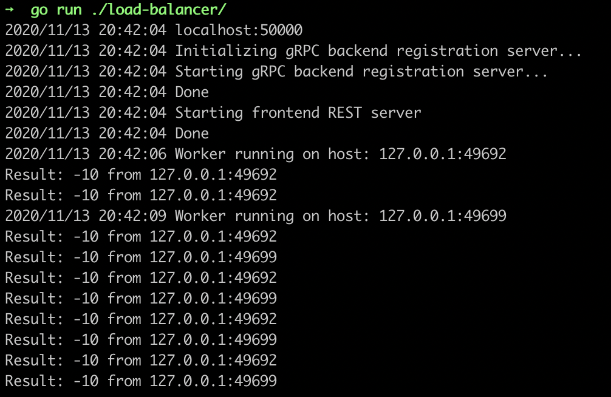
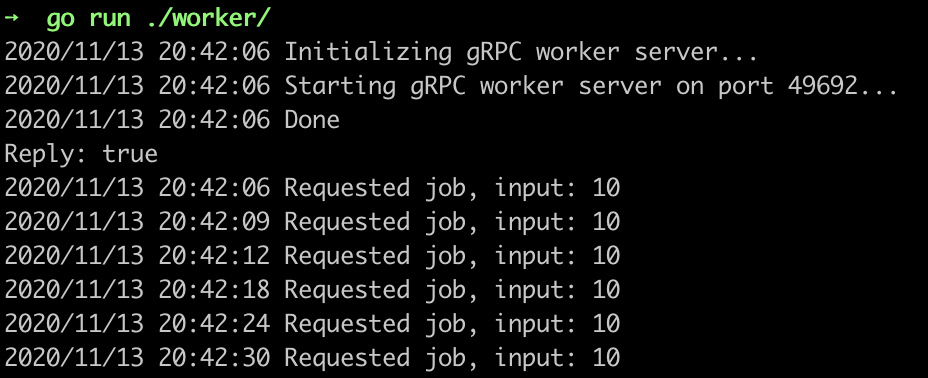
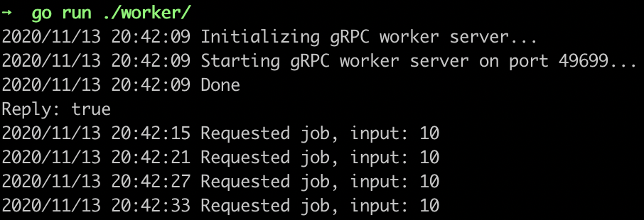

# Implementation of load balancer via gRPC with dynamic worker allocation

Some TODOs:
- [x] Implement server REST API (Very simple one)
- [x] (**doing**) Finish implementing worker registration in GRPC
    - [x] do strip IP ports
- [ ] Learning concurrency: implement worker heartbits
    - [ ] allow dynamic deallocation
    - [ ] implement worker closing
- [ ] Propagate http request

## This walkthrough implements

- A simple golang server with a REST API
- On the backend, the server distributes requests to workers
- Workers register and deregister themselves, allowing scalability
- LB implements dynamic load via goroutines which block on an input queue

**Server:**



**Worker 0**



**Worker 1**




## Caveats / learnings
(in an absolutely random order)

### Wrap things into goroutines
```go
log.Println("Starting gRPC backend registration server...")

go func() {
    grpcServer.Serve(lis)
}()

log.Println("Done")
```

### Copy prohibiting in Go

No native way but anything that implements `sync.Locker` interface:
```go
type unableToCopy struct{}

// Implementing this interface disallows to copy `unableToCopy`
func (*unableToCopy) Lock() {}
func (*unableToCopy) UnLock() {}
```
### Command to run `protoc`

```bash
protoc --go_out=. --go_opt=paths=source_relative \
    --go-grpc_out=. --go-grpc_opt=paths=source_relative \
    PROTO
```
### Idiom of queue as a channel, which contains channels as callbacks
``` go
type Request struct {
	Input  int32
	Output chan *pb.JobReply
	Err    chan error
}
```

### Closing channel notifies all
```go
func workerGoroutine(host string, quit <-chan workerStopper, inputQueue <-chan *Request) {
	// ...

	for {
		select {
		// ...
		case <-quit:
			// quitting here
			return
		}
	}
}
```
